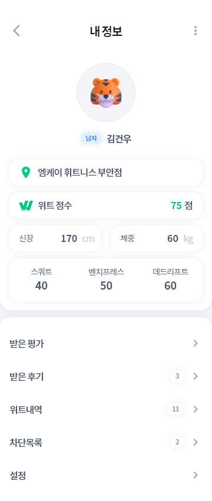

<!-- PROJECT LOGO -->

 

  

  ## Witt - With Training
  

    
    
    
    
     
  

  

    Health matching app 헬스인들을 위한 운동 파트너 매칭 앱  
     
    <a href="https://play.google.com/store/apps/details?id=com.gwnu.witt&hl=ko-KR"><strong>Google Play »</strong></a>
    ·
    <a href="https://projects-lj.notion.site/With-Training-2aca57d461f94f918dab38773869c3a6?pvs=4"><strong>Explore the docs (Notion) »</strong></a>
     
     
  

 

<!-- TABLE OF CONTENTS -->

  
목차

  <ol>
    <li>
      <a href="#프로젝트-개요">프로젝트 개요</a>
      <ul>
        <li><a href="#개발-환경">개발 환경</a></li>
        <li><a href="#개발-기술">개발 기술</a></li>
      </ul>
    </li>
    <li><a href="#프로젝트-구조">프로젝트 구조</a></li>
    <li><a href="#팀원">팀원</a></li>
    <li><a href="#License">License</a></li>
  </ol>

 

<!-- ABOUT THE PROJECT -->
## 프로젝트 개요

"위트 - With Training"은 운동 파트너 매칭 앱으로서, 혼자 운동하기 어려운 사람, 운동을 처음 시작하는 헬스 초보, 안전한 운동을 위해 운동 보조를 찾는 헬스인을 대상으로 합니다. 운동 루틴과 운동 기록을 바탕으로 비슷한 수준의 운동 파트너를 매칭해줌으로써, 운동 동기 부여와 안전한 운동을 돕는 기능을 제공합니다.

 

### 개발 환경

* Android Studio
* Android SDK 33 (min SDK 22)
* Java 17
* Gradle 7.2.2
* AWS EC2, RDS
* 협업 툴 : Discord, Notion, Figma

### 개발 기술

* 
* 
* 
* 
* 
* 
* 
* 
* 
<!--  *  -->

(<a href="#readme-top">back to top</a>)

<!-- CONTACT -->
## 프로젝트 구조

  
Back-End 구조

  

(<a href="#readme-top">back to top</a>)

## 상세 기능

## 1. 메인 페이지
|                메인페이지 (월)            |                   메인페이지 (화)         |
|----------------------------------------|----------------------------------------|
|             |        |

### 유사한 운동 루틴을 가진 사용자 찾기
- **운동 루틴 및 스케줄 유사성**
  - 사용자와 운동 루틴(스케줄)이 유사한 상대를 표시
  - 운동 시간과 세부 정보가 유사한 상대 제시
  - 이 기능을 사용하기 위해서 사용자가 사전에 자신의 루틴을 만들어야함

### 유사한 운동 수준의 사용자 찾기
- **운동 수행 능력**: 사용자가 입력한 운동 수행 능력과 운동 기록을 바탕으로 운동 수준을 판별하고 비슷한 수준의 사용자 제공함

### 거리가 가까운 사용자 찾기
- **근접한 사용자 검색**: 사용자와의 거리가 가까운 상대 제시

### 리스트에 표시될 정보
- **프로필 이미지**: 사용자의 프로필 이미지
- **이름(닉네임)**: 사용자의 이름 또는 닉네임
- **운동 시간**: 각 사용자의 운동 시간
- **운동 부위**: 각 사용자가 집중하는 운동 부위

### 상세 프로필 확인
- **프로필 클릭**: 리스트에서 특정 사용자를 클릭 시 그 사용자의 상세 프로필을 확인 가능

 

## 2. 회원가입,  로그인
|                로그인                  |                   회원가입               |
|----------------------------------------|----------------------------------------|
|    |  |

### 구글 플랫폼 로그인
  -  사용자의 아이디별 토큰 인증을 통해 중복 로그인 방지
  -  로그인 기록을 관리하여 자동 로그인 기능을 제공함으로써 사용자의 편의성 향상

 

## 3. 마이 프로필, 상대 프로필
|                마이프로필                  |                상대 프로필               |
|-----------------------------------------|----------------------------------------|
|            | |

### 마이 프로필
  - **자신의 정보 확인**: 신체정보, 헬스장, 3대 측정 결과 등
  - **받은 평가**: 같이 운동한 사람에게 받은 간단한 선택형 후기 
  - **받은 후기**: 같이 운동한 사람에게 받은 텍스트형 후기 
  - **위트 내역**: 다른 사용자와 같이 운동한 내역을 확인
  - **차단 목록**: 차단한 상대방 확인 및 해제 가능
  - **설정**: 앱의 기본 설정 기능
    
### 상대 프로필
  - **상대방의 정보 확인**
  - **상대방의 루틴 정보 확인**: 해당 요일에 상대방이 설정해놓은 루틴 
  - **신고 내역**: 상대방이 다른 유저에게 받은 신고 목록

 

## 4. 루틴 페이지
|                 루틴 생성                   |                루틴 생성               |
|-----------------------------------------|----------------------------------------|
|   |  |

### 운동 루틴 생성
- **요일 설정:** 원하는 요일 마다 운동 루틴을 생성 가능
- **루틴 시간 설정:** 아침, 점심, 저녁, 새벽 시간 중 한 가지를 선택 가능
- **운동 추가:** 원하 운동을 추가할 수 있습니다. 최소 하나의 운동 필요
- **운동 설정:** 선택한 운동의 세트 수, 무게, 횟수를 입력 가능
- 입력한 정보를 토대로 운동 루틴이 생성됩니다.

 

## 5. 채팅 페이지

|     채팅 목록 및 삭제      |             채팅        |
|-------------------------|-------------------------|
|  |  |

### 채팅 기능
- **실시간 채팅**: 사용자는 1:1로 상대방과 실시간으로 채팅 가능
- **알림 표시**: 채팅 목록에서 아직 읽지 않은 채팅에는 초록색 테두리로 알림을 띄워 사용자에게 알림
- **메시지 입력**: 채팅방에서 메시지를 입력시 전송 버튼 활성화
- **채팅방 이동**: 채팅방에서 좌측 상단의 채팅방 나가기 모달 버튼을 통해 채팅 목록 페이지로 이동 가능
- **최근 메시지 표시**: 가장 최근 메시지를 채팅방 리스트에 표시하여 사용자가 최신 상태를 쉽게 확인 가능
- **추가 기능**: 사용자는 채팅방에서 후기 보내기, 차단하기, 신고하기, 채팅방 나가기 등의 기능을 사용 가능

 

## 6. 받은 평가, 받은 후기

|                받은 평가                  |                   받은 후기              |
|----------------------------------------|----------------------------------------|
|    | |

운동 파트너와 운동 후 서로 피드백 할 수 있습니다.

### 받은 평가
- 사용자는 체크박스 형식으로 여러 항목 중에서 선택하여 후기 남김
### 받은 후기
- 사용자는 텍스트 형식으로 후기 작성 가능

 

## 7. 위트 내역, 차단 목록

|                위트 내역                  |                   차단 목록               |
|----------------------------------------|----------------------------------------|
|    | |

### 위트 내역
- **운동 기록 확인**: 사용자가 과거에 함께한 파트너와 함께한 운동 기록 확인 
- **날짜별 검색**: 전체, 1주, 1개월, 1년 단위로 날짜와 함께 세션의 상세한 정보 확인 

### 차단 목록
- **차단 목록 확인**: 사용자가 차단한 다른 유저들의 목록을 확인
- **차단한 유저 검색**: 사용자가 차단한 유저를 검색
- **차단 해제**: 차단한 유저를 해제 기능

 

(<a href="#readme-top">back to top</a>)

<!-- CONTACT -->
## 팀원

**Lee June**

- GitHub: [@marso34](https://github.com/marso34)
- Mail: <a href="mailto:mars102aq@gmail.com">mars102aq@gmail.com</a>
- Portfolio: [Notion](https://leejune.notion.site/Portfolio-70b846886e2e41368280f5a7e49f9e0d)

**Kim Dohyun**

- GitHub: [@ooANAoo](https://github.com/ooANAoo)
- SNS: [@SNS_name]()
- Mail: <a href="mailto:gim670079@gmail.com">gim670079@gmail.com</a>

**Lee Hyeongwon**

- GitHub: [@hwstar-1204](https://github.com/hwstar-1204)
- SNS: [@SNS_name]()
- Mail: <a href="mailto:hwstar1204@gmail.com">hwstar1204@gmail.com</a>

**Jo Sunghyun**

- GitHub: [@sunghyun123](https://github.com/sunghyun123)
- SNS: smkaia11
- Mail: <a href="mailto:jhgfds5951@gmail.com">jhgfds5951@gmail.com</a>

**Kim Gunwoo**

- SNS: [@SNS_name]()
- Mail: <a href="mailto:kwoo6643@gmail.com">kwoo6643@gmail.com</a>

(<a href="#readme-top">back to top</a>)

<!-- LICENSE -->
## License

This project is licensed under the terms of the <a href=".\LICENSE.md">MIT</a> license.
